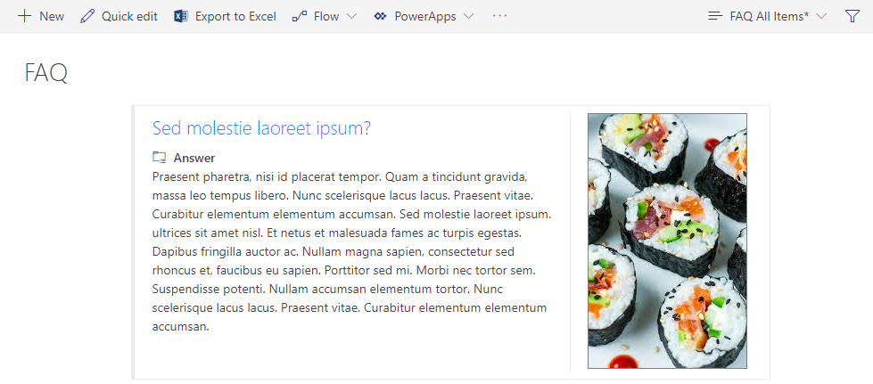

# Frequently Asked Questions

The Frequently Asked Questions or FAQ formats a view in a modern list as cards, images included.

## List & Fields Requirements

The list contains 3 fields as shown below. Keep the field names the same if you want the sample to work seemlessly. If you change any fieldnames, change the names in the JSON file accordingly. To use this row formatting sample, create a new custom list, called FAQ and add or update the following fields in the list:

| Field | Type | Description
--- | --- | ---
Title | Single Line of Text | Field contains the question asked. Default `Title` field.
Answer | Multi Line of Text / Plain Text | Field contains the answer, formatted as plain text.
Picture | Hyperlink or Picture | Hyperlink formatted as picture displayed on the right site of the question and answer.

## Adding the Row Formatting JSON Code

To add the row formatting code, follow the steps below:
1. Create in the FAQ list (created above) a new view called FAQ
2. In the view dropdown, choose _Format current view_
3. Paste the JSON code from the **row-formatting.json** file into the panel

> NOTE: in the JSON there are references like `[Your Tenant Url]`, replace these with the absolute url to your tenant, for example `https://tenant.sharepoint.com`.
 
4. Choose _Preview_ to show a sample of the new formatted view, note: the formatted view is not saved yet, closing the panel will discard all changes you made without confirmation!
5. Choose _Save_ to make it available for the end user

## Food for Thought

- Try adding a category choice field and make views per categorie
- Try adding a link field and show the link in the FAQ item to redirect people to more information about the FAQ

## DISCLAIMER
> THIS CODE IS PROVIDED AS IS WITHOUT WARRANTY OF ANY KIND, EITHER EXPRESS OR IMPLIED, INCLUDING ANY IMPLIED WARRANTIES OF FITNESS FOR A PARTICULAR PURPOSE, MERCHANTABILITY, OR NON-INFRINGEMENT.